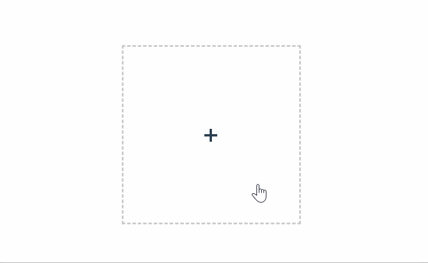

**vue-img-uploader**



# Installation
```
npm install vue-img-uploader 
```
# Use
```
import Vue from 'vue'
import loader from 'vue-img-uploader'

Vue.use(loader)
```
# Get Start
```
<template>
  <div>
    <loader :config='config' :output='output'/>
  </div>
</template>

<script>
export default{
    data(){
      return{
          output:[],
          config:{
            ext:'',
            size:function(s){},
            width:function(w){},
            height:function(h){}
          }
      }
    }
}
</script>
```

# Props
**ouputs**:<br/>*An array to storage input files*  
**ext**:<br/>*Image extention name,eg:'png','jpg'..*  
**size,width,height**:<br/>*A function that handle the input image file's size/width/height*,<br/>
*To interrupt the input process,"return false" in these functions*

# More
Check source code to customize your css style  
Use this.$refs.[ref].reset( ) to clear thumb-image manually

# License
MIT